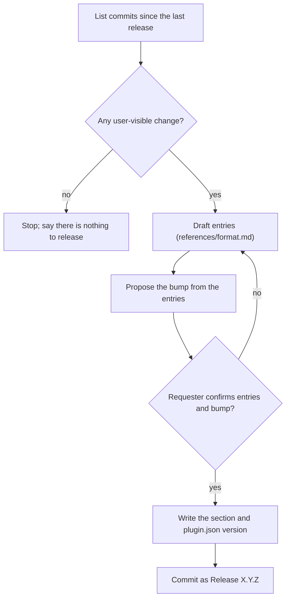

## Goal

A kit user reads one release section and knows what now works differently for them.

## In

- Commits since the last `Release X.Y.Z` commit, and their diffs
- Current `version` in `.claude-plugin/plugin.json`
- The bump, confirmed by the requester (ask if missing)

## Out

- `## X.Y.Z (YYYY-MM-DD)` section at the top of `CHANGELOG.md`
- The new `version` in `.claude-plugin/plugin.json`
- One `Release X.Y.Z` commit holding only those two files

## Flow

## Rules

- **Commit only touches CI, `.claude/`, docs wording, or a refactor** → leave it out
  - *Because:* the log is for people using kit; they never see those
- **Several commits ship one feature** → write one entry
  - *Because:* users meet features, not commits
- **Entry names the edit ("updated X")** → rewrite it as what the user now gets
  - *Because:* the diff shows the edit; the effect is what a user can't see
- **A change breaks an existing config or command** → the entry says what the user must change
  - *Because:* an upgrade that silently turns the gate red costs more than the feature gives
- **Any entry is not Fixed** → bump minor; only Fixed entries → bump patch
  - *Because:* before 1.0, minor carries features and breaks; users read a patch as safe

## Done When

- [ ] Every entry is one line starting Added, Changed, Removed, or Fixed
- [ ] The heading's version matches `.claude-plugin/plugin.json`
- [ ] Every user-visible commit since the last release has an entry
- [ ] Requester read the section and confirmed the bump
- [ ] `claude plugin validate .` passes

## Never

- Why lines, sub-bullets, paragraphs, or tables
- Editing a section that already shipped
- A version bump without its CHANGELOG section, or the reverse

## More

- [references/format.md](references/format.md): section shape, finding the commits, ✗/✓ examples
