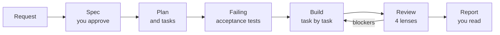

# kit

Spec-driven feature builds for [Claude Code](https://claude.com/claude-code). You approve a short spec; an agent team plans it, writes failing tests, builds it task by task, reviews it through four lenses, and hands back a one-screen report.

```
/kit:build Let visitors join a waitlist with their email
```

## Why kit

Agents write code fast. The hard parts are agreeing on what to build, knowing it works, and keeping the next feature consistent with the last one. kit handles those three with files and scripts, not longer prompts.

- **A spec you can approve in two minutes.** Numbered behaviors and decisions, each with a default and its alternative. You reply by ID: "B3: show an error instead."
- **Tests before code.** Every behavior becomes an acceptance test that fails first. A task is done only when a script says its gate is green.
- **Rules enforced by scripts, not prose.** Formats are linted on every write, and each agent can only write the files its role allows. A builder can't edit the tests that judge it.
- **Independent review.** Reviewers for behavior, code, security, and UX start from fresh context and need evidence (a failing probe, a screenshot, or a `file:line`) to block.
- **A codebase that learns.** Architecture choices become decision records, and repeated patterns become rules, so the next build starts from what this one settled.

## Quick start

**Requirements:** Claude Code, git, Python 3.11+ as `python3`, and macOS or Linux. Test runners: Playwright, Vitest, or Jest.

**1. Install the plugin**

```bash
claude plugin marketplace add nateshernandez/skills
claude plugin install kit@nateshernandez
```

**2. Set up your project.** In a Claude Code session in your repo:

```
/kit:setup
```

Setup detects your package manager and test runner, writes `.claude/kit/config.json` from a preset, and runs your checks once. It stops if they're red, because every task would fail on a red baseline.

**3. Build your first feature.** Start with something small:

```
/kit:build Show a "copied" toast when someone copies a share link
```

You'll be asked to approve the spec. After that, kit works until it can show you the report.

## What a build looks like



1. **Spec.** `specs/001-waitlist/spec.md`: an outcome line, decisions (`1.D1`), behaviors (`1.B1`), and what's out of scope. UI features also get a static prototype and screenshots.
2. **Plan.** A planner writes `plan.md` and `tasks.json`: vertical slices, each of which leaves the app working.
3. **Tests.** A test author writes one acceptance test per behavior from the spec alone, and confirms each one fails.
4. **Build.** One builder per task, each with fresh context. `mark_task.py` runs the gate and marks the task done only when it's green.
5. **Review.** A verifier, plus code, security, and UX reviewers as the change calls for, each write findings with evidence. Blockers become fix tasks, for up to three rounds.
6. **Report.** `report.md` marks each behavior ✓ or ✗ and lists what was decided without you, what was codified, and how to try it.

You touch two files: the spec, before anything is built, and the report, at the end. Everything else is the agents' memory, committed so any session can resume with `/kit:build <spec number>`.

Each build works on its own branch and leaves a short, linear history: one commit for the spec, one for the tests, one per task, one per review round, and one for the records. Subjects are imperative one-liners, like `Dedupe repeated waitlist joins`. Branches land by rebasing, never by merge commits.

## Architecture

Run `/kit:architecture` once, before or after the design system, so every feature's code lands where the next reader expects it.

1. **Homes.** Routes, business modules, shared UI, platform (database, session, outside services), and pure helpers. Imports flow one way, and code moves to a shared home only when a second module needs it.
2. **One module shape.** Each module has the same entries and four flat folders: `use-cases/` (what can be done), `domain/` (the rules), `infra/` (storage and outside services), and `components/` (the UI). Imports point inward, so rules test without mocks.
3. **A spec and a guide.** The architecture spec builds the lint, and `docs/architecture.md` is the contract: a question tree that places any code, examples for each file role, and the UI rules.
4. **Checks.** The recipe's lint fails a broken boundary on the write. `check_shape.py` fails a file a module has no place for, or a source file past 250 lines.

An existing app keeps working while it moves: its current files go in a baseline that only shrinks, and each move is its own spec. Version 1 has a recipe for Next.js and React.

## Design systems

For an app with a UI, run `/kit:design-system` once before building features. It needs Mobbin's connector, or screenshots of apps you like.

1. **Research.** It measures real screens from the apps you name and writes `docs/design/look.md`, citing each by its Mobbin link.
2. **Two specs.** Design foundations (tokens, theme, gallery, drift lint) and core screens (list, detail, form, settings, notices, deletes, waiting, empty). You approve them like any spec.
3. **A guide.** `docs/design/guide.md` is the contract: planners pick each screen's layout from it, builders follow it, and the UX reviewer cites it.
4. **Checks.** `check_tokens.py` fails any token pair under WCAG AA in each theme the app ships, and any colour outside the tokens file. The UX reviewer runs axe, tap target, clipped text, and lost focus checks on every screen.

The system grows as features need it: a screen the guide doesn't cover gets a decision in its own spec, and a piece a second feature reuses moves into the guide. Version 1 has a recipe for Next.js, Tailwind 4, and shadcn.

## Skills

| Command | What it does |
| --- | --- |
| `/kit:setup` | Writes the config, checks the gate is green, and adds a CLAUDE.md section |
| `/kit:architecture` | Writes the spec and guide for where your app's code goes, and the checks that hold it there |
| `/kit:design-system` | Researches a look on Mobbin and writes the specs and guide for your app's design system |
| `/kit:build` | Runs a feature from request to report, or resumes one |
| `/kit:write-spec` | Writes a spec on its own, for planning ahead |
| `/kit:write-decision` | Records an architecture or policy choice in `docs/decisions/` |
| `/kit:write-rule` | Writes a `.claude/rules/` file that loads only where it applies |
| `/kit:write-skill` | Writes a skill in the same format kit uses |
| `/kit:write-agent` | Writes a subagent, with write fences |
| `/kit:write-changelog-entry` | Logs a change to your project's `.claude/` setup |

The agents run the rest of the skills: `plan-spec`, `write-acceptance-tests`, `build-task`, `verify-spec`, `review-code`, `review-security`, and `review-ux`.

## What kit adds to your project

```
.claude/kit/config.json          commands for the gate, test paths, the review app
.claude/kit/checklists/<lens>.md optional: your stack's review checks
.claude/rules/git-commits.md     commit, branch, and push conventions, unless you have your own
specs/<NNN>-<slug>/              spec, plan, tasks, progress, reviews, screens, report
docs/decisions/<NNNN>-<slug>.md  decision records, written after review
docs/architecture.md             where code goes, if you run /kit:architecture
docs/design/guide.md, look.md    the design system agents build UI from, if you run /kit:design-system
tests/acceptance/, tests/probes/ acceptance tests and reviewers' probes (paths are configurable)
tests/kit/ux-checks.ts           UX checks the UX reviewer runs on every screen, for Playwright apps
```

kit's hooks do nothing in a project without `.claude/kit/config.json`, so it's safe to install at user scope.

## Configuration

`/kit:setup` writes the config for you. A minimal one for a TypeScript library:

```json
{
  "check": "pnpm lint && pnpm typecheck && pnpm test",
  "check_full": "pnpm lint && pnpm typecheck && pnpm test && pnpm build",
  "tests": {
    "runner": "vitest",
    "acceptance": "tests/acceptance/{spec}.test.ts",
    "probes": "tests/probes/{spec}-{lens}.test.ts",
    "run": "pnpm exec vitest run {files} -t {grep}"
  }
}
```

[docs/configuration.md](docs/configuration.md) covers every field, including the shared review app, screenshots, and format and lint on write.

## Sharing with a team

Commit the config, then register the marketplace for the repo so teammates are offered kit when they trust the folder:

```bash
claude plugin marketplace add nateshernandez/skills --scope project
```

## Updating

```bash
claude plugin update kit@nateshernandez
```

Or turn on auto-update for the `nateshernandez` marketplace under **Marketplaces** in `/plugin`.

## Good to know

- **Cost.** A medium feature runs a planner, a test author, one builder per task, and two to four reviewers per round. Use it for features, not one-line fixes.
- **Small changes.** Size `S` specs skip the planner and run a single task.
- **Turbo mode.** `/kit:build --turbo <request>` keeps the spec, your approval, the tests, the gates, and the verifier, but runs one builder and one review round, with no code or UX review. Set `build.mode` to make it the default; see [Build modes](docs/configuration.md#build-modes).
- **Your stack's conventions.** kit reads your CLAUDE.md, `.claude/rules/`, and decision records. Put stack-specific review checks in `.claude/kit/checklists/<lens>.md`.
- **Platforms.** macOS and Linux. On Windows, use WSL.

More detail: [docs/how-it-works.md](docs/how-it-works.md).

## Contributing

Issues and pull requests are welcome. [CLAUDE.md](CLAUDE.md) describes the repo layout and the checks a change must pass.

## License

[MIT](LICENSE)
