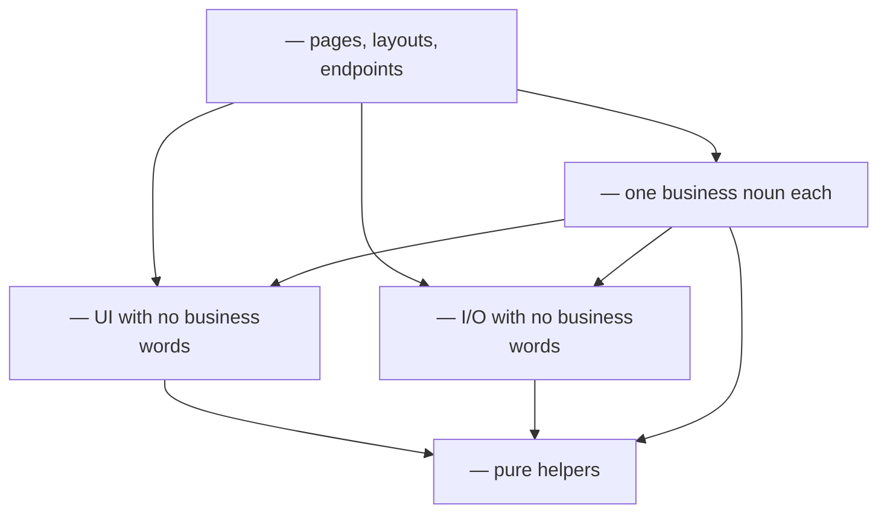

# Architecture

Every piece of code has one home, and the folder names say what's inside. A reader finds a feature by its business word, then its file by the question it answers. Lint and kit's shape check fail when code lands in the wrong place, and each message names the right one.

## Where code goes

Answer in order; the first yes is the home.

- **Is it a URL: a page, layout, or endpoint?** → `<routes folder>`; it reads the request, builds the context, calls a module, and renders or responds
- **Does it use a business word, like <two of this app's nouns>?** → the module named for that word, in `<modules folder>`; see [A module](#a-module)
- **Is it UI?** → `<components folder>`: the kit, layouts, patterns, and hooks; it knows no business word
- **Does it do I/O or need a secret: database, session, environment, an outside service, HTTP?** → `<platform folder>`, in the folder named for the capability, like `db/` or `session/`
- **None of these** → `<lib folder>`: pure helpers like formatting and diffing; no I/O, no UI

Code moves down to a shared home only when a second module needs it. Until then it stays in the module that uses it.

## Homes



- **Routes** → may import modules (through their public entries), components, platform, and lib
- **Modules** → may import components, platform, lib, and other modules through their public entries; never routes; no cycles
- **Components** → lib only; data arrives as props, never from platform
- **Platform** → lib only; never UI, modules, or routes
- **Lib** → other lib files only

## A module

One module per noun people say, named the way they say it. Every module has the same shape, so knowing one is knowing them all.

```text
<modules folder>/<one of this app's modules>/
  <client entry>     public, client-safe: components and types
  <server entry>     public, server-only: the use cases other code may call
  <form adapters>    adapters from a form submission to a use case
  use-cases/         what can be done: one file per action, named verb-noun
  domain/            what the rules are: types, schemas, and decisions; no I/O
  infra/             how it's stored and sent: tables, queries, outside services
  components/        how it looks: <component file kinds>
```

- **Imports inside** → components and use cases import domain; use cases import infra; infra imports domain; domain imports only `<lib folder>`
- **From outside** → only `<client entry>` and `<server entry>`; every other file is internal and free to change
- **Flat folders** → no subfolders; a module that needs them is two modules
- **Leave out** → any folder the module doesn't need yet

### Use cases

A use case is one thing a person or another module can do: `create-ticket`, `close-invoice`.

- **Signature** → `<use case signature>`: who's asking, then the raw input
- **Body, top to bottom** → parse the input with its schema; load; decide with domain rules; store; return
- **Result** → expected failures come back as values (`{ ok: false, error }`); anything else throws
- **Who's asking** → built once, at the edge (page, form adapter, endpoint), never inside a use case; so another module's use case can call this one in the same transaction
- **Returns** → only the fields callers show, never a raw record

### Domain

The rules, readable without knowing the database or the framework. Status changes, limits, prices, prompt text, permissions: if it decides, it lives here and is tested without mocks.

### Infra

Storage and outside services for this module: table definitions, queries named for what they return, and calls to services through `<platform folder>` clients. No decisions; a query that needs an `if` is a domain rule waiting to be pulled out.

## Between modules

- **One module needs another** → call its `<server entry>` from a use case, passing who's asking along
- **Direction** → the dependent module calls the owner; the owner never learns the dependent exists
- **A screen shows two modules** → the route composes them: one module's component takes the other's as `children` or a slot; a module's components never import another module
- **Two modules need each other** → one of them owns a noun that belongs to the other; move it

## UI code

<the recipe's UI rules>

## Examples

<the recipe's examples, one per file role>

## What's shared

One line per shared piece, added when a second module needs it: the need, then the export and its path.

- **Who's asking, and their transaction** → <context type and builder> from `<platform folder>/session`, once a feature signs people in
- <each shared piece the builds add>

## Check it

- **Lint** → `<lint file>` fails an import that breaks a home, a module's entries, or a direction inside a module; a cycle; a secret read outside `<platform folder>` or `infra/`; browser code importing server code
- **Shape** → kit's `check_shape.py` runs on every write and in every gate: a module's root and folders hold only their kinds of file, and no source file passes <max lines> lines (tests excepted)
- **Code from before the architecture** → when the config names a baseline, the files it lists pass while they don't grow, and leave the list as they move

## Growing the architecture

- **A module passes about 12 use cases, or holds two nouns that share no rules** → split it into two modules
- **A second module needs a piece one module built** → move it down to its shared home and add a line under What's shared
- **A new kind of I/O, like email or payments** → a folder in `<platform folder>`, added by the first feature that needs it
- **Code fits no home** → ask the requester; a new home arrives with a spec decision and its lint
