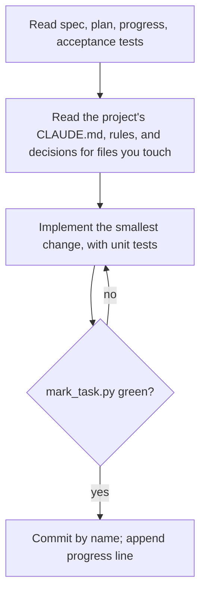

## Goal

One task implemented, gated green, marked, committed, and logged; the app works after it.

## In

- Spec ID and task ID (default: first task not passing)
- `spec.md`, `plan.md`, `progress.md`, and the task's acceptance tests

## Out

- Code and unit tests for this task only, committed
- `passes: true` in tasks.json, set by `mark_task.py`
- One line appended to `specs/<id>/progress.md`

## Flow

## Rules

- **A locked file looks wrong (spec, acceptance tests, probes, tasks)** → log `blocked:` with the reason; stop
  - _Because:_ the orchestrator fixes plans; editing a check to pass it is cheating
- **The same failure survives 3 attempts** → log `blocked:` with the error; stop
  - _Because:_ a fresh look beats a fourth guess in the same context
- **Building UI** → follow the design guide `design.guide` names in the config: the screen's layout, its patterns, components, and tokens
  - _Because:_ one design system keeps screens consistent, and the UX reviewer judges against the guide
- **Tempted to write a decision record or rule** → note the pattern in progress.md; the orchestrator codifies after review
  - _Because:_ records and rules describe reviewed code, not one task's draft
- **Moved or renamed a file a decision record cites** → update that record's `code:` line only
  - _Because:_ `check_decisions.py` fails on a stale path; the decision itself is unchanged
- **Ready to check the task** → run `python3 ${CLAUDE_PLUGIN_ROOT}/scripts/mark_task.py <spec> <task>` in the foreground with Bash `timeout` 600000
  - _Because:_ it runs the task gate, then marks the task; nothing else may flip `passes`
- **The gate is killed at the limit** → run it again; never write a wait loop (`sleep`, `until grep`)
  - _Because:_ a green tree is stamped, so a rerun is safe; a hand-made loop is one more way to hang
- **The gate prints red** → read the log it names; don't rerun the gate to see the error again
  - _Because:_ the log already holds the full output, and a rerun costs the whole gate
- **Checking one change while you work** → run its unit test or the one test file, not the gate
  - _Because:_ the gate's minutes belong at the end; a single file answers in seconds
- **Tempted to start the next task** → stop after this one
  - _Because:_ a fresh context per task keeps quality even across the build
- **Committing** → one commit for the task, following `.claude/rules/git-commits.md`
  - _Because:_ one commit per task makes each revertable, and the log reads as a list of changes

## Done When

- [ ] `mark_task.py <id> <task>` printed `passes`
- [ ] The commit contains only this task's files
- [ ] progress.md has `- **<task>** → <what changed; anything the next task should know>`

## Never

- Editing spec.md, tasks.json, acceptance tests, or probes
- Special-casing test inputs, or type and lint suppressions to go green
- Pushing

## More

- [../../scripts/mark_task.py](../../scripts/mark_task.py): runs the task gate, then marks the task
- [../../scripts/gate.py](../../scripts/gate.py): the gate, the builder's stop hook; logs each run, skips a green tree
