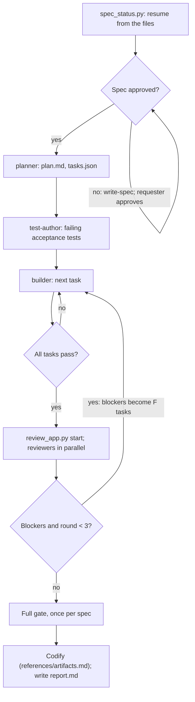

## Goal

The requested feature ships working, passes every lens, and comes back as a one-screen report.

## In

- The request, or a spec ID to resume (ask if missing); `--turbo` or `--standard` if given
- Scripts named here run as `python3 ${CLAUDE_PLUGIN_ROOT}/scripts/<name>.py`

## Out

- `specs/<id>/` artifacts (references/artifacts.md)
- Commits on the spec's branch, per `.claude/rules/git-commits.md`: spec, tests, one per task, findings, records
- `specs/<id>/report.md`, shown to the requester

## Flow

## Rules

- **Starting or resuming** → run `spec_status.py [number]` and continue from what the files say
  - _Because:_ the files are the team's memory; a new session knows nothing else
- **Picking the mode** → resolve it per references/turbo.md; in turbo, its rules replace these where they differ
  - _Because:_ turbo trades the planner, per-task builders, two lenses, and later rounds for speed
- **Spec just approved** → on a branch named for the spec, set `status: building` and commit before delegating
  - _Because:_ the builder's stop gate only runs for specs marked building
- **Size S** → skip the planner; write a one-task tasks.json and run `check_tasks.py` on it
  - _Because:_ planning a one-task change costs more than the change
- **Delegating** → pass only the spec ID, task ID, and round; run one builder at a time
  - _Because:_ fresh context keeps reviews independent; builders share one tree and gate
- **Choosing reviewers** → verifier and code-reviewer always; ux-reviewer if UI changed and `screenshots` is set; security-reviewer if input, storage, auth, or secrets changed
  - _Because:_ each reviewer costs a full context; run those with something to check
- **Builder reports blocked** → fix the plan, tasks, or tests yourself, or ask the requester
  - _Because:_ a wrong locked file is a planning error, not the builder's to patch
- **No blockers left** → `gate.py <id> --full` once; red → F task per failing test, one rerun, then blocked
  - _Because:_ only the full check catches a break elsewhere; once at the end pays once
- **A builder runs over 8 minutes or looks stalled** → read its last tool call's age (`stat -L` on its transcript); tell the requester; never stop it on a guess
  - _Because:_ the task output file is a symlink; plain `stat` reads the link and always looks frozen
- **Reviewers finish** → `review_app.py stop`; revert edits outside their fences; commit findings, screens, and probes once
  - _Because:_ one commit per round keeps the log readable
- **Blockers remain after round 3** → set `status: blocked`; report each ✗ with one question
  - _Because:_ a fourth round rarely converges; the requester unblocks faster
- **A choice is made after approval** → record it for the report's Decided without you
  - _Because:_ the requester sees every guess, not only the approved ones

## Done When

- [ ] `spec_status.py <id>` shows every task passing
- [ ] Latest round: every verdict is `pass`, or the spec is `blocked`
- [ ] Report lints, `check_ids.py <id>` and `check_decisions.py` pass, spec is `done` or `blocked`, all committed
- [ ] Requester has the report

## Never

- Writing app code or flipping `passes` yourself; the builder and `mark_task.py` do
- Skipping approval unless the requester waived it

## More

- [references/artifacts.md](references/artifacts.md): every file in `specs/<id>/`, task list, findings, report, codify
- [assets/report-template.md](assets/report-template.md): blank report to copy
- [references/turbo.md](references/turbo.md): the faster mode: what it cuts, keeps, and reports
- [../../scripts/spec_status.py](../../scripts/spec_status.py): where each spec stands and its mode
