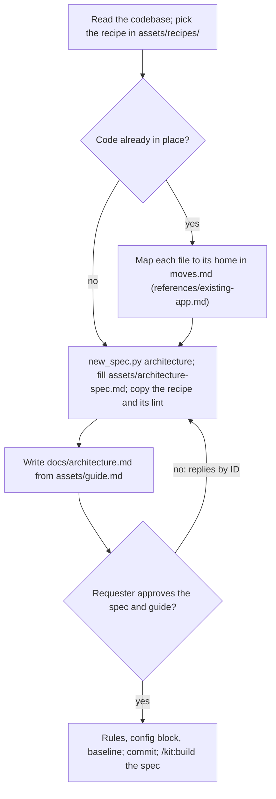

## Goal

An approved spec and guide that place every piece of code, with checks that fail on drift.

## In

- The codebase: stack, folders, and any modules or shared code it already has
- What the app does and the nouns its people say, from `docs/product/brief.md`'s Words, README, and specs (ask if missing)
- `.claude/kit/config.json`; scripts run as `python3 ${CLAUDE_PLUGIN_ROOT}/scripts/<name>.py`

## Out

- `specs/<NNN>-architecture/`: spec from assets/architecture-spec.md, the recipe and its lint file; `moves.md` for an existing app
- `docs/architecture.md` from assets/guide.md
- The recipe's rules in `.claude/rules/`, and the `architecture` block in the config
- `.claude/kit/architecture-baseline.json`, for an existing app

## Flow

## Rules

- **No recipe matches the stack** → stop and name the stacks kit has recipes for
  - _Because:_ builders copy the recipe's lint and examples; guessed mechanics are where drift starts
- **Naming modules** → one per noun the business says, in its own words, like `tickets` or `invoices`
  - _Because:_ folders that name the business let a reader find a feature without reading code
- **The app already has modules** → keep their names; split one only when it holds two nouns sharing no rules
  - _Because:_ a rename touches every import and earns little; a split pays for itself
- **Code already in place** → list every file that moves in moves.md, grouped into one later spec per move
  - _Because:_ small moves stay reviewable, and the app works between them
- **Writing the guide** → copy assets/guide.md; fill every `<…>` from the recipe and this app's modules
  - _Because:_ builders and reviewers read the guide from the first task
- **Replies by ID** → apply them as write-spec does; re-run `lint_spec.py`
  - _Because:_ an approved ID means one thing forever
- **Spec approved** → copy the recipe's rules; add its `architecture` block to the config; commit both
  - _Because:_ from then on every planner, builder, and reviewer reads the guide, and `check_shape.py` runs
- **Turning on the checks in an existing app** → set `architecture.baseline`; run `check_shape.py --write-baseline`
  - _Because:_ today's files pass while they don't grow; anything new meets the shape

## Done When

- [ ] The spec gives every folder the app has a home; moves.md covers every file that moves
- [ ] `lint_spec.py` passes; the guide has no `<…>` left
- [ ] `check_shape.py` passes on the tree, with the baseline for an existing app
- [ ] Spec approved; rules copied; the config has `architecture`; one commit

## Never

- Moving or rewriting app code; the build and the move specs do
- Loosening a boundary so today's code passes; baseline it instead
- Adding a home, folder, or layer the recipe lacks without a spec decision

## More

- [references/existing-app.md](references/existing-app.md): mapping existing files to homes, the moves list, and the baseline
- [assets/architecture-spec.md](assets/architecture-spec.md): the architecture spec
- [assets/guide.md](assets/guide.md): the architecture guide
- [assets/recipes/next.md](assets/recipes/next.md): the mechanics for Next and React
- [assets/recipes/next/architecture.mjs](assets/recipes/next/architecture.mjs): the recipe's lint
- [assets/recipes/next/code-placement.md](assets/recipes/next/code-placement.md): rule for where code goes
- [assets/recipes/next/react-components.md](assets/recipes/next/react-components.md): rule for React code
- [../../scripts/check_shape.py](../../scripts/check_shape.py): module shape and file length
