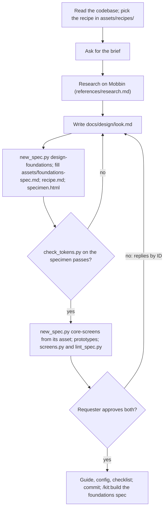

## Goal

Two approved specs and a design guide that, once built, let agents ship accessible, consistent screens without per-screen design.

## In

- Purpose and users (from `docs/product/brief.md` if present), themes (light, dark, both), 2–3 apps whose look they like (ask if missing)
- The codebase: stack, and any tokens or components it already has
- Mobbin's connector (`search_screens`, `search_flows`); without it, screenshots or URLs from the requester
- `.claude/kit/config.json` with `screenshots` set; scripts run as `python3 ${CLAUDE_PLUGIN_ROOT}/scripts/<name>.py`

## Out

- `docs/design/look.md`: sources, measurements, proposed tokens (references/look-format.md)
- `specs/<NNN>-design-foundations/`: spec, `recipe.md`, `specimen.html`, screens
- `specs/<NNN>-core-screens/`: spec, one prototype per layout and pattern shown, screens
- `docs/design/guide.md` from assets/guide.md, the `design` block in the config, and `.claude/kit/checklists/ux.md`

## Flow

## Rules

- **No recipe matches the stack** → stop and name the stacks kit has recipes for
  - _Because:_ builders follow the recipe's mechanics; guessed mechanics are where drift starts
- **The app already has tokens or components** → keep their names; restyle them to the look
  - _Because:_ renaming breaks every screen already built on them
- **Choosing a value** → measure it from the reference screens and cite them; adjectives aren't evidence
  - _Because:_ "modern and clean" gives every app the same look; measured screens give this one its own
- **The specimen's CSS** → `specimen.css`, tokens in `:root` and `.dark` as the recipe defines them; `:root` alone for one theme
  - _Because:_ `check_tokens.py` then checks the real pairs, before any app code exists
- **Adding to the core screens spec** → only what every app needs; a domain layout waits for the first feature that uses it
  - _Because:_ half of btnext's prebuilt pieces never reached a real screen
- **Writing the guide** → copy assets/guide.md and fill every `<…>` from look.md and the recipe; component paths are what the build will create
  - _Because:_ builders and reviewers read the guide from the first task
- **Replies by ID** → apply them as write-spec does; re-run `check_tokens.py`, `screens.py`, and `lint_spec.py`
  - _Because:_ a changed token can fail a pair the last run passed
- **Both specs approved** → set both to `approved`; add `design` (`guide`, `tokens`, `gallery`) to the config; copy assets/ux-checklist.md, filled in
  - _Because:_ from then on every planner, builder, and reviewer reads the guide

## Done When

- [ ] look.md cites every source screen by `mobbin_url` or the requester's link, and every token by its evidence
- [ ] `check_tokens.py specs/<id>/specimen.css` passes in each theme the app ships; `--theme=<it>` there and on `screens.py` for one
- [ ] `lint_spec.py` passes on both specs; their screens show phone and desktop, in each theme the app ships
- [ ] Both specs approved; the guide has no `<…>` left; config has `design` (and `themes` for one); one commit

## Never

- Writing app code; the build does
- Committing Mobbin images or other apps' screenshots
- Building a domain layout before a feature needs it

## More

- [references/research.md](references/research.md): searching Mobbin, reading screens, citing them
- [references/look-format.md](references/look-format.md): sources, measurements, and proposed tokens
- [assets/foundations-spec.md](assets/foundations-spec.md): the foundations spec
- [assets/core-screens-spec.md](assets/core-screens-spec.md): the core screens spec
- [assets/guide.md](assets/guide.md): the design guide, with the core layout and pattern rules
- [assets/ux-checklist.md](assets/ux-checklist.md): the project's UX checklist
- [assets/recipes/next-tailwind-shadcn.md](assets/recipes/next-tailwind-shadcn.md): the Next, Tailwind 4, and shadcn mechanics
