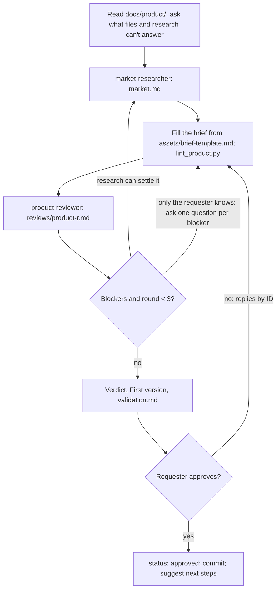

## Goal

An approved `docs/product/brief.md` whose every claim cites evidence or names the test that will settle it.

## In

- The idea, in the requester's words (ask if missing)
- `docs/product/` from an earlier run, with results in validation.md (references/validation.md)
- Scripts named here run as `python3 ${CLAUDE_PLUGIN_ROOT}/scripts/<name>.py`

## Out

- `docs/product/brief.md` from assets/brief-template.md (references/brief-format.md)
- `docs/product/market.md` and `reviews/product-r<n>.md`, from the market-researcher and product-reviewer
- `docs/product/validation.md` from assets/validation-template.md

## Flow

## Rules

- **Starting** → ask only for ambition, why them, constraints, and who they've already talked to
  - _Because:_ research answers the rest; every open choice becomes a PD item with a default
- **Sending research** → give market-researcher the idea and those answers, never a draft brief
  - _Because:_ research run after the brief gets cherry-picked to support it
- **Writing a claim** → grade it with the weakest true grade; a guess gets a PA item and its test
  - _Because:_ an honest `assumed` survives an investor; a stretched `inferred` falls at the second question
- **Judging Size and Model** → hold them to the ambition's bar in references/business-basics.md
  - _Because:_ a fine indie business can be a bad venture pitch; one bar for both misleads
- **Blockers left after round 3** → each becomes a PA with a test; the verdict can't be `go`
  - _Because:_ a fourth round rarely converges; a test settles what argument can't
- **Setting the verdict** → rate each dimension from the brief's items; `stop` is a good outcome
  - _Because:_ stopping costs a day; building what nobody pays for costs months
- **First version** → only features that test a PA, riskiest first; often a priced landing page
  - _Because:_ the first build exists to learn; everything else waits for evidence
- **Replies by ID** → apply them; after approval, retire a changed PD, PA, or PF and add a new ID
  - _Because:_ specs and validation results cite those IDs
- **Requester approves** → commit docs/product; suggest validation.md's first test, then `/kit:setup`
  - _Because:_ setup, the design system, and specs read the brief from then on

## Done When

- [ ] `lint_product.py` passes on every file in `docs/product/`
- [ ] The latest product review passes, or each open blocker is a PA with a test
- [ ] Every verdict rating cites brief items or market.md sources
- [ ] Requester approved; `status: approved`; one commit

## Never

- Writing app code or specs; `/kit:build` does
- Softening a weak rating to reach `go`
- Committing raw Reddit pulls or interview notes with names

## More

- [references/brief-format.md](references/brief-format.md): sections, evidence grades, verdict, IDs, review findings
- [references/business-basics.md](references/business-basics.md): what each section answers, ambition bars, rating the verdict
- [references/validation.md](references/validation.md): interviews, smoke tests, and recording results
- [assets/brief-template.md](assets/brief-template.md): blank brief to copy
- [assets/validation-template.md](assets/validation-template.md): blank validation plan to copy
- [../research-market/SKILL.md](../research-market/SKILL.md): what the market-researcher agent does
- [../review-product/SKILL.md](../review-product/SKILL.md): what the product-reviewer agent does
