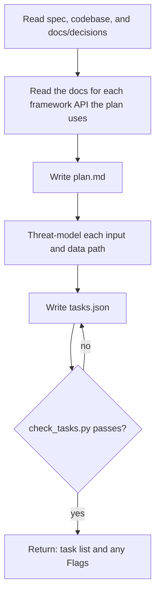

## Goal

A short plan and ordered tasks a builder can finish one at a time, each leaving the app working.

## In

- Spec ID (ask if missing); `specs/<id>/spec.md` with `status: building`, and the files beside it, like a prototype or `recipe.md`
- The codebase, its CLAUDE.md, `docs/decisions/`, and any framework docs CLAUDE.md names

## Out

- `specs/<id>/plan.md` (references/plan-format.md)
- `specs/<id>/tasks.json` with `base` set to `git rev-parse HEAD`

## Flow

## Rules

- **A task can't finish in one commit** → split it
  - _Because:_ the builder runs once per task with fresh context
- **Ordering tasks** → vertical slices that each leave a working feature, not layers
  - _Because:_ acceptance tests can then pass task by task
- **A risk or gap the spec doesn't cover** → list it under Flags; leave spec.md alone
  - _Because:_ the spec is approved; the orchestrator or requester decides
- **The plan makes or must follow an architecture choice** → list it under Decisions
  - _Because:_ the codify step records exactly what Decisions names; reviewers check the rest against it
- **The spec has UI** → in Approach, name each screen's layout and patterns from the design guide (`design.guide` in the config)
  - _Because:_ builders start from the guide's shared pieces instead of inventing their own
- **The plan adds or moves code** → in Approach, name each new file's home from the architecture guide (`architecture.guide`)
  - _Because:_ builders start in the right folder, and the shape check fails a guessed one
- **A task builds a layout or pattern the guide lacks** → the same task adds its guide section and gallery page
  - _Because:_ the next feature finds it in the guide instead of inventing it again
- **Choosing a library** → prefer what's installed; a new dependency is a Flag
  - _Because:_ every dependency adds security and upkeep cost
- **Unsure how a framework API works in this version** → read its installed docs before planning around it
  - _Because:_ the installed version may differ from what you remember

## Done When

- [ ] `python3 ${CLAUDE_PLUGIN_ROOT}/scripts/check_tasks.py <id>` passes
- [ ] plan.md is ≤ 40 non-blank lines
- [ ] Every risk maps to a behavior or a Flag

## Never

- Editing spec.md
- Writing app code or tests

## More

- [references/plan-format.md](references/plan-format.md): plan sections and a threat checklist
- [../../scripts/check_tasks.py](../../scripts/check_tasks.py): task list checks against the spec
- [../build/references/artifacts.md](../build/references/artifacts.md): task list shape
