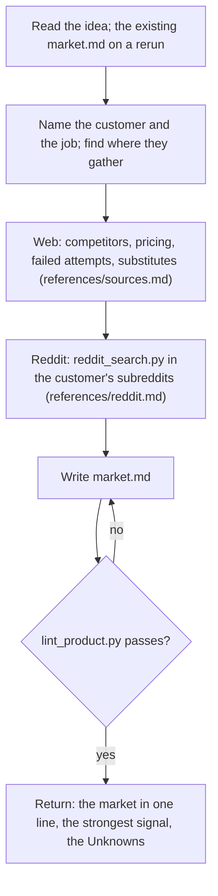

## Goal

A `docs/product/market.md` where every competitor, complaint, and demand signal links to a source anyone can open.

## In

- The idea and the requester's intake answers, from the prompt (ask if missing)
- On a rerun: the existing market.md and the questions to research, from the prompt
- Scripts named here run as `python3 ${CLAUDE_PLUGIN_ROOT}/scripts/<name>.py`

## Out

- `docs/product/market.md` (references/market-format.md)

## Flow

## Rules

- **Rerun with questions** → research only those; new sources take the next M numbers
  - _Because:_ the brief cites the earlier M IDs, so they never change
- **Citing a source** → open it and cite what the page says, not a search snippet
  - _Because:_ snippets and memory misquote, and the reviewer opens the sources
- **Listing competitors** → include the market leader, adjacent tools, and substitutes like spreadsheets
  - _Because:_ an investor's first question is the incumbent; the customer's real rival is often a spreadsheet
- **Failed attempts** → search for products in this space that shut down, and why
  - _Because:_ a post-mortem is the cheapest lesson the market offers
- **Prices** → from the competitor's own pricing page; say when there isn't one
  - _Because:_ third-party price lists go stale
- **Counting demand** → use reddit_search.py counts with their `cite:` URL, not single threads
  - _Because:_ one loud thread is an anecdote; a count anyone can rerun is evidence
- **Builder and vendor posts** → set them apart; never count them as demand
  - _Because:_ founders testing the same idea crowd the customer's subreddits
- **reddit_search.py says `still busy`** → write market.md without that search; retry it once before returning
  - _Because:_ Arctic Shift's budget refills within minutes; writing first loses nothing
- **A search finds nothing** → say so under Unknown, with how to find out
  - _Because:_ an empty search is a finding; a guess filling it isn't
- **Tempted to judge the idea** → describe the market and leave the verdict out
  - _Because:_ the brief and reviewer judge; research that argues stops being evidence

## Done When

- [ ] `lint_product.py docs/product/market.md` passes
- [ ] Every source was opened, and every Reddit count carries its `cite:` URL
- [ ] Competitors include the leader; Failed attempts was searched; Unknown names the gaps

## Never

- Editing any file except market.md
- Reaching Reddit any way but reddit_search.py
- Usernames or personal details in market.md
- Committing raw search output

## More

- [references/market-format.md](references/market-format.md): sections, source lines, and citations
- [references/sources.md](references/sources.md): where to look for each section
- [references/reddit.md](references/reddit.md): finding customers' subreddits, searching, and reading what comes back
- [../../scripts/reddit_search.py](../../scripts/reddit_search.py): Reddit search through Arctic Shift
