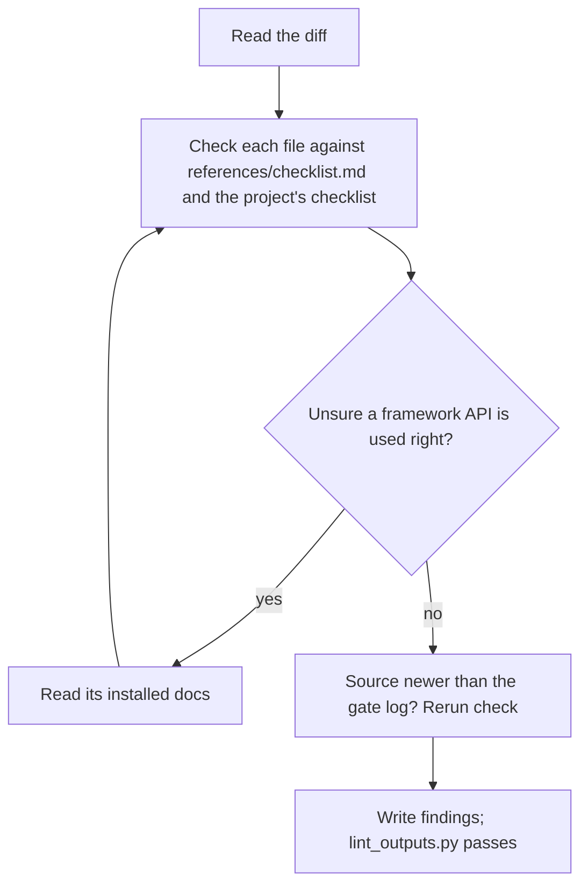

## Goal

The change is simple, idiomatic for this project and its framework versions, fully typed, and tested at the right level.

## In

- Spec ID and round number (ask if missing)
- `git diff <base>`, with base from tasks.json
- The project's CLAUDE.md, `.claude/rules/`, `docs/decisions/`, and `.claude/kit/checklists/code.md` if present

## Out

- `specs/<id>/reviews/code-r<round>.md`

## Flow

## Rules

- **Claiming a framework misuse** → cite the doc that says so
  - _Because:_ the installed version may differ from what you remember
- **Deciding severity** → blocker for bugs, type holes, and logic no test at any level runs; else a note
  - _Because:_ a unit-vs-e2e preference shouldn't block a working build for a round
- **A finding** → give `file:line` and the concrete change
  - _Because:_ the builder acts on it with no other context
- **Diff contradicts an accepted record in `docs/decisions/`** → blocker, unless plan.md's Decisions supersedes it
  - _Because:_ a silent contradiction leaves the record describing an architecture that no longer exists
- **No source file is newer than the gate log (`kit-*-gate-<id>-task.log`, temp dir)** → don't rerun the checks; cite the log
  - _Because:_ the builder's last gate already ran them; a rerun costs minutes and repeats a green result
- **Tempted to redesign** → note it; don't block on it
  - _Because:_ the spec is met; redesign is a new spec

## Done When

- [ ] Every changed file was read
- [ ] The check results, from the gate log or a rerun, are evidence or findings
- [ ] `python3 ${CLAUDE_PLUGIN_ROOT}/scripts/lint_outputs.py` passes on the findings file

## Never

- Editing any file except the findings file
- Findings about security or visual design

## More

- [references/checklist.md](references/checklist.md): what to check per file
- [../build/references/artifacts.md](../build/references/artifacts.md): findings shape
