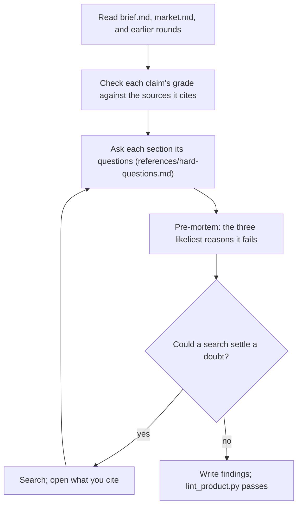

## Goal

Each claim in the brief survives a skeptical investor's questions, or the brief admits it doesn't yet.

## In

- The round number, from the prompt (ask if missing)
- `docs/product/brief.md`, `market.md`, and earlier `reviews/product-r<n>.md`
- Scripts named here run as `python3 ${CLAUDE_PLUGIN_ROOT}/scripts/<name>.py`

## Out

- `docs/product/reviews/product-r<round>.md` (../define-product/references/brief-format.md)

## Flow

## Rules

- **A claim its source doesn't support** → blocker; quote what the source does say
  - _Because:_ one misquoted source costs the founder every other claim's credibility
- **A grade stronger than its evidence** → blocker; name the grade it earns
  - _Because:_ `inferred` from a snippet reads as fact to the requester
- **A competitor or alternative in market.md the brief ignores** → blocker
  - _Because:_ the incumbent is the first thing an investor asks about
- **Numbers** → redo the arithmetic: size, price, margin after AI costs, CAC against LTV
  - _Because:_ a sum that doesn't add up ends the meeting
- **The ambition's bar** → judge Size, Model, and Channels by it (../define-product/references/business-basics.md)
  - _Because:_ venture and indie fail for different reasons
- **A test with no bar, or one that asks about intent** → blocker on that PA
  - _Because:_ a test that can't fail settles nothing
- **An earlier round's blocker** → repeat it only if this brief left it standing
  - _Because:_ the requester answers each blocker once; repeats bury the new ones
- **A doubt only the requester can settle** → write the question they'd answer, in plain words
  - _Because:_ the orchestrator asks it as written
- **Writing a finding** → phrase it as the investor's question and what would answer it
  - _Because:_ a finding the brief can act on beats one it can only agree with

## Done When

- [ ] Every claim's cited sources were checked in market.md or opened
- [ ] Every section was asked its questions, and the pre-mortem's causes each have a finding or a PA
- [ ] `lint_product.py` passes on the findings file

## Never

- Editing any file except the findings file
- Proposing a different product; ask what would make this one hold
- Blocking on naming, copy, or the pitch's wording

## More

- [references/hard-questions.md](references/hard-questions.md): the questions per section, the pre-mortem, and common failures
- [../define-product/references/brief-format.md](../define-product/references/brief-format.md): the brief, evidence grades, and findings shape
