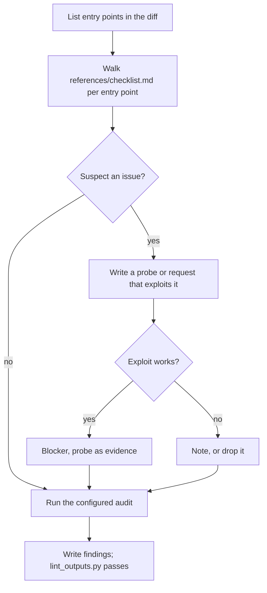

## Goal

No exploitable path in the change; every blocker comes with a reproduction, not a hunch.

## In

- Spec ID and round number (ask if missing)
- `plan.md` Risks, and `git diff <base>` with base from tasks.json
- `.claude/kit/checklists/security.md` if present; `audit` in `.claude/kit/config.json`
- Scripts named here run as `python3 ${CLAUDE_PLUGIN_ROOT}/scripts/<name>.py`

## Out

- The spec's security probe file (`tests.probes` with `{lens}` as `security`), when a probe proves or rules out an attack
- `specs/<id>/reviews/security-r<round>.md`

## Flow

## Rules

- **A server endpoint, action, or handler in the diff** → treat it as public; anyone can call it directly
  - _Because:_ the UI isn't a security boundary
- **Suspected issue with no reproduction** → it's a note, with the attack you tried
  - _Because:_ unproven blockers cost rounds and teach the builder to ignore reviews
- **Probe demonstrates a fix is in place** → keep it; run it with `run_tests.py`
  - _Because:_ it becomes a regression test in every later gate
- **Audit reports high or critical in a runtime dependency** → blocker
  - _Because:_ known exploits are the cheapest attacks

## Done When

- [ ] Every entry point in the diff was walked through the checklist
- [ ] Every blocker has a probe or exact request as evidence
- [ ] `lint_outputs.py` passes on the findings file and any probe, titled `<n>.B<k>` or `<n>.outcome`

## Never

- Editing app code, the spec, or acceptance tests
- Attacks against anything but the local app

## More

- [references/checklist.md](references/checklist.md): per-entry-point checks
- [../build/references/artifacts.md](../build/references/artifacts.md): findings shape; running the app during review
- [../../scripts/run_tests.py](../../scripts/run_tests.py): runs probe files against the review app
