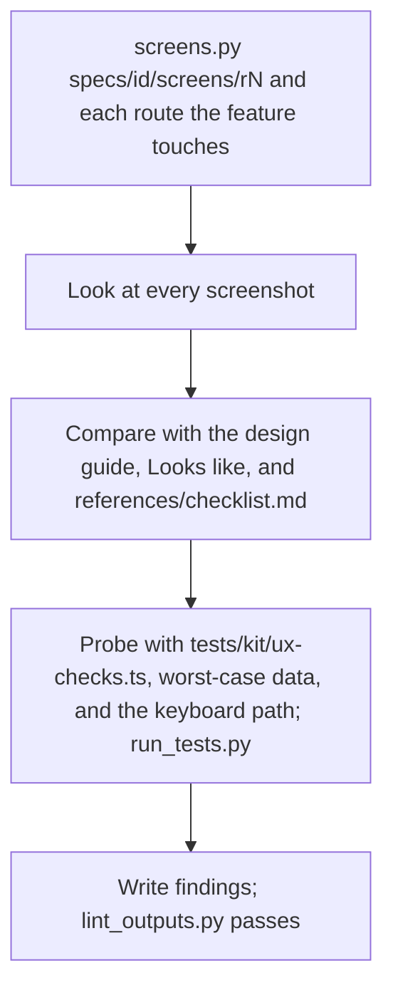

## Goal

The feature looks native to this app, and a first-time visitor finishes it on phone and desktop.

## In

- Spec ID and round number (ask if missing)
- `specs/<id>/spec.md`, including its Looks like screens
- The design guide `design.guide` names in `.claude/kit/config.json`, and its gallery route, if set
- `.claude/kit/checklists/ux.md` if present: the project's design system and blocker bar
- Scripts named here run as `python3 ${CLAUDE_PLUGIN_ROOT}/scripts/<name>.py`

## Out

- `specs/<id>/screens/r<round>/*.png`
- The spec's UX probe file (`tests.probes` with `{lens}` as `ux`) for keyboard and state checks
- `specs/<id>/reviews/ux-r<round>.md`

## Flow

## Rules

- **Judging a screen** → look at the screenshot image itself; never judge from code
  - _Because:_ critique grounded in the rendered screen is what finds real problems
- **Deciding severity** → blocker only for the checklist's blocker bar; taste is a note
  - _Because:_ blockers cost a build round; taste shouldn't
- **A finding** → name the fix, not only the problem
  - _Because:_ the builder acts on it with no other context
- **Spec's Looks like differs from the build** → blocker only if a behavior or the outcome suffers
  - _Because:_ prototypes are sketches, not pixel contracts
- **The design guide has a rule for what's on screen** → judge against it and cite its line; it outranks the prototype
  - _Because:_ the guide is what every screen shares; a prototype is one feature's sketch

## Done When

- [ ] Every route the feature touches is captured at mobile and desktop
- [ ] Every blocker has a screenshot or failing probe as evidence
- [ ] `lint_outputs.py` passes on the findings file and any probe, titled `<n>.B<k>` or `<n>.outcome`

## Never

- Editing app code, the spec, or acceptance tests
- Findings about code style or security

## More

- [references/checklist.md](references/checklist.md): blocker bar and what to look for
- [../build/references/artifacts.md](../build/references/artifacts.md): findings shape; running the app during review
- [../../scripts/screens.py](../../scripts/screens.py): phone and desktop, light and dark screenshots
