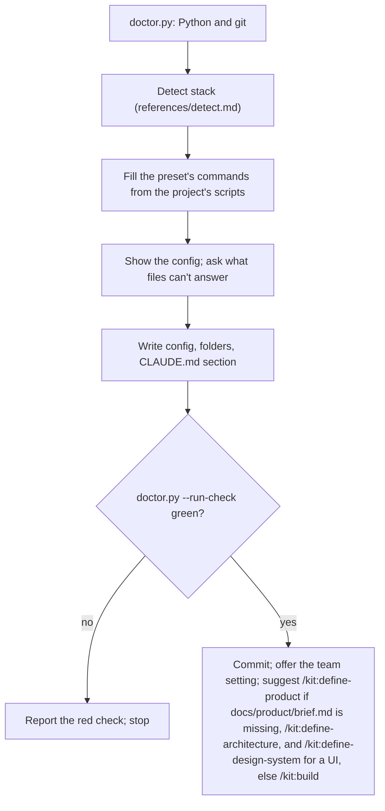

## Goal

A green gate, kit's folders, and a CLAUDE.md section, so `/kit:build` works on the first request.

## In

- The project: its package manager, scripts, test runner, and whether it has a UI
- Answers from the requester, only for what the files can't tell you
- Scripts named here run as `python3 ${CLAUDE_PLUGIN_ROOT}/scripts/<name>.py`

## Out

- `.claude/kit/config.json`, from a preset in assets/
- `specs/` and `docs/decisions/`, each with a `.gitkeep`
- The section in assets/claude-md-section.md, added to CLAUDE.md
- `.claude/rules/git-commits.md` from assets/, unless the project already sets commit conventions
- `tests/kit/ux-checks.ts` from assets/, when the project has a UI tested with Playwright
- One commit with all of it

## Flow

## Rules

- **The config already exists** → run `doctor.py` first and fix only what it flags
  - _Because:_ setup reruns to repair, and the requester may have tuned the commands
- **Choosing a preset** → Playwright when the project has browser tests or a web UI; else Vitest or Jest, whichever it uses
  - _Because:_ acceptance tests should observe the app the way its users do
- **Filling `check`** → chain the project's own scripts: format check, lint, types, unit tests, build
  - _Because:_ the gate must match what the project's CI already enforces
- **A command the preset names doesn't exist** → use the project's equivalent, or drop that part and say so
  - _Because:_ a gate that calls a missing script is red forever
- **The project has no UI** → leave out `app` and `screenshots`
  - _Because:_ the UX lens and prototypes only run when `screenshots` is set
- **The project has a UI tested with Playwright** → copy the UX checks; add `@axe-core/playwright` to devDependencies only with a yes
  - _Because:_ UX probes import them, so every build checks screens against the same bar
- **Playwright starts its own server** → suggest `webServer.port` read `KIT_PORT`, and reuse a running server when `REUSE_SERVER` is set; edit only with a yes
  - _Because:_ the gate and reviewers run servers side by side; fixed ports collide
- **`check` is red on the current tree** → stop and report; don't commit the setup
  - _Because:_ every task would fail on a red baseline and look like the builder's fault
- **Setup is committed** → offer `claude plugin marketplace add nateshernandez/skills --scope project` for teammates; run it only with a yes
  - _Because:_ it writes `.claude/settings.json`, which everyone who clones the repo shares

## Done When

- [ ] `doctor.py --run-check` prints no FAIL lines
- [ ] CLAUDE.md has the kit section once
- [ ] The setup commit holds only the config, the folders, CLAUDE.md, the commit rule, and the UX checks

## Never

- Editing app code, test config, or CI during setup without a yes
- Committing a config whose `check` is red

## More

- [references/detect.md](references/detect.md): where each config value comes from
- [assets/config.playwright.json](assets/config.playwright.json): web apps tested in a browser
- [assets/config.vitest.json](assets/config.vitest.json): libraries, APIs, and CLIs tested with Vitest
- [assets/config.jest.json](assets/config.jest.json): the same, with Jest
- [assets/claude-md-section.md](assets/claude-md-section.md): the section added to the project's instructions
- [assets/git-commits.md](assets/git-commits.md): commit, branch, and push rule for every session
- [assets/ux-checks.ts](assets/ux-checks.ts): side scroll, tap targets, clipped text, lost focus, and axe, for UX probes
- [../../scripts/doctor.py](../../scripts/doctor.py): readiness checks, one line each
