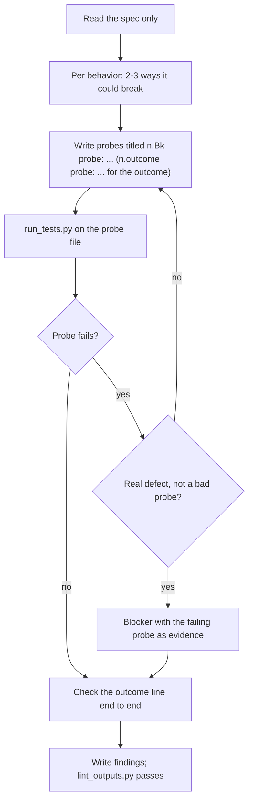

## Goal

Evidence, not trust: each behavior and the spec's outcome hold in the real app, including cases the acceptance tests skip.

## In

- Spec ID and round number (ask if missing)
- `specs/<id>/spec.md` only; `.claude/kit/config.json` for where probes go
- Scripts named here run as `python3 ${CLAUDE_PLUGIN_ROOT}/scripts/<name>.py`

## Out

- The spec's quality probe file: `tests.probes` with `{spec}` filled and `{lens}` as `quality`
- `specs/<id>/reviews/quality-r<round>.md` (../build/references/artifacts.md)

## Flow

## Rules

- **Tempted to read plan.md, progress.md, or the diff** → don't
  - _Because:_ independent assumptions are what catch the builder's blind spots
- **Picking probes** → edge inputs, repeats, refresh, back button, and states (references/probe-ideas.md)
  - _Because:_ acceptance tests cover the happy path the builder aimed at
- **Writing a probe** → same runner and style as the acceptance tests (../write-acceptance-tests/references)
  - _Because:_ probes join the gate from now on, so they must run the same way
- **A probe passes** → keep it
  - _Because:_ it guards against regressions in every later gate
- **Every behavior passes but the outcome line isn't true** → blocker with ref `outcome`; title its probe `<n>.outcome probe: ...`
  - _Because:_ the product lens judges the whole, not the parts
- **More than 3 probes for one behavior** → keep the 3 most likely to break
  - _Because:_ each probe adds time to every future gate

## Done When

- [ ] Every behavior has at least one probe or a stated reason it needs none
- [ ] `lint_outputs.py` passes on the findings file
- [ ] Every blocker names its failing probe

## Never

- Editing app code, the spec, or acceptance tests
- Starting, stopping, or rebuilding the app; the orchestrator runs it for the round
- A blocker without a reproduction

## More

- [references/probe-ideas.md](references/probe-ideas.md): where behaviors usually break
- [../build/references/artifacts.md](../build/references/artifacts.md): findings shape; running the app during review
- [../../scripts/run_tests.py](../../scripts/run_tests.py): runs probe files against the review app
