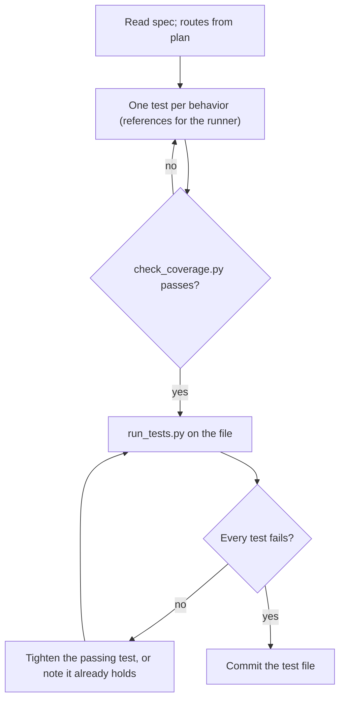

## Goal

One test per behavior, from the spec alone, that fails now and passes only when the behavior is real.

## In

- Spec ID (ask if missing); `specs/<id>/spec.md`
- `specs/<id>/plan.md`, for routes and entry points only
- `.claude/kit/config.json`: `tests.runner` and the `tests.acceptance` path
- Scripts named here run as `python3 ${CLAUDE_PLUGIN_ROOT}/scripts/<name>.py`

## Out

- The spec's acceptance test file, at `tests.acceptance` with `{spec}` filled, committed

## Flow

## Rules

- **Naming a test** → `<n>.B<k> <situation>`, the full ID and words from the spec
  - _Because:_ the gate and the report find tests by behavior ID
- **Writing for the runner** → follow references/playwright.md or references/vitest.md, by `tests.runner`
  - _Because:_ each runner has its own way to observe what a person would
- **Asserting storage or side effects** → check through the UI or a public interface
  - _Because:_ reading internals couples the test to one implementation
- **A delay or expiry is part of the behavior** → move the clock or age stored state; never sleep
  - _Because:_ a real wait costs every run on every machine
- **A test passes before the build** → tighten it until it can fail
  - _Because:_ a test that can't fail proves nothing
- **Behavior already holds in the app** → keep the passing test; tell the orchestrator
  - _Because:_ the report should say it was already true

## Done When

- [ ] `check_coverage.py <id>` passes
- [ ] Every test ran and failed, or is reported as already holding
- [ ] The test file is committed

## Never

- Skipped, focused, or todo tests (`.skip`, `.only`, `.todo`, `.fixme`)
- Importing app internals into an acceptance test
- Editing spec.md or app code

## More

- [references/playwright.md](references/playwright.md): browser tests: a complete example file
- [references/vitest.md](references/vitest.md): Vitest and Jest tests: a complete example file
- [../../scripts/check_coverage.py](../../scripts/check_coverage.py): one test per behavior, no extras
- [../../scripts/run_tests.py](../../scripts/run_tests.py): runs one spec's tests with the configured runner
