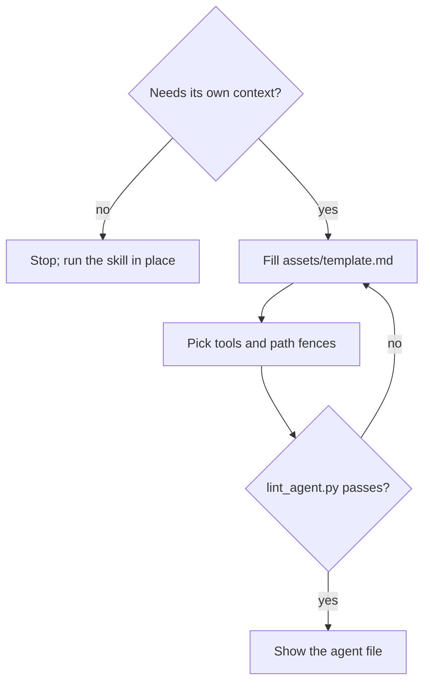

## Goal

A thin agent file: who runs, with which tools and fences, preloading one skill that holds the how.

## In

- The skill the agent runs (ask if missing)
- Why it needs its own context: independence, tool limits, or context size
- Scripts named here run as `python3 ${CLAUDE_PLUGIN_ROOT}/scripts/<name>.py`

## Out

- `.claude/agents/<name>.md`

## Flow

## Rules

- **Procedure text lands in the agent body** → move it into the skill
  - _Because:_ one source of truth; the skill also runs without the agent
- **Choosing tools** → list only what the skill's Flow uses
  - _Because:_ a reviewer that can't edit can't quietly fix what it should report
- **Agent must not touch some files** → list globs under `fence-deny` or `fence-allow`
  - _Because:_ fences in prose get crossed under pressure; the settings hook enforces these
- **Agent's output has a bar** → add a SubagentStop hook in settings.json keyed on `agent_type`
  - _Because:_ hooks in agent frontmatter don't fire (verified 2026-09-26); settings hooks do

## Done When

- [ ] `lint_agent.py` passes
- [ ] The preloaded skill exists and holds the whole procedure
- [ ] `.claude/CHANGELOG.md` has its entry (write-changelog-entry)

## Never

- Procedures, checklists, or headings in the agent body
- `tools` left out, which grants every tool
- `hooks:` in agent frontmatter; they silently never run

## More

- [references/format.md](references/format.md): fields, fences, limits
- [assets/template.md](assets/template.md): blank agent to copy
- [../../scripts/lint_agent.py](../../scripts/lint_agent.py): format lint; also runs on every write
