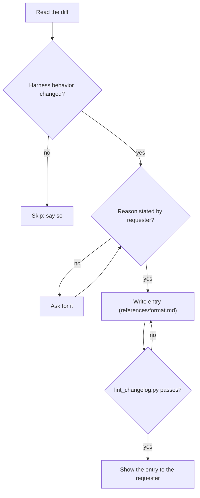

## Goal

A future reader learns what the harness now does differently, and why, in two lines per change.

## In

- The finished harness change (read its diff)
- The reason for it, in the requester's words (ask if missing)
- Scripts named here run as `python3 ${CLAUDE_PLUGIN_ROOT}/scripts/<name>.py`

## Out

- Entry under this branch's one `## YYYY-MM-DD` at the top of `.claude/CHANGELOG.md`

## Flow

## Rules

- **Change is a typo, rewording, or reformat** → skip the entry
  - _Because:_ noise entries bury the ones worth reading
- **Several edits serve one purpose** → write one entry
  - _Because:_ the reader wants decisions, not a file list
- **Reason isn't in the conversation** → ask; never infer it from the diff
  - _Because:_ an invented why is the slop this log exists to avoid
- **Headline describes the edit ("updated X")** → rewrite it as what the agent now does
  - _Because:_ the diff already shows the edit; behavior is what the reader can't see
- **Branch already added a date heading** → add the entry under it and change its date to today
  - _Because:_ a pull request lands on main on one day; sessions and UTC midnight split one change set
- **A past entry is wrong** → add a new entry; leave the old one
  - _Because:_ the log is history; rewriting it hides why things changed

## Done When

- [ ] `lint_changelog.py` passes
- [ ] `check_branch_dates.py` passes
- [ ] Every Why is the requester's reason, not a guess
- [ ] Requester read the entry and confirmed it

## Never

- Paragraphs, tables, or sub-bullets beyond the one Why
- Entries for changes that don't alter harness behavior

## More

- [references/format.md](references/format.md): entry shape, limits, ✗/✓ examples
- [../../scripts/lint_changelog.py](../../scripts/lint_changelog.py): format and vague-word lint; also runs on every write
- [../../scripts/check_branch_dates.py](../../scripts/check_branch_dates.py): one new date heading per branch; also runs on every write
