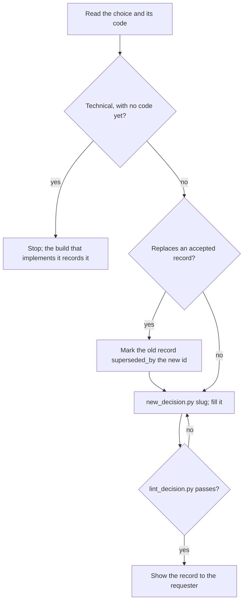

## Goal

A record a new engineer reads in a minute and learns what was chosen, why, and where the code is.

## In

- The choice: a spec D item, a plan's Decisions entry, or a policy from the requester (ask if missing)
- For a technical choice: the committed code that implements it
- Scripts named here run as `python3 ${CLAUDE_PLUGIN_ROOT}/scripts/<name>.py`

## Out

- `docs/decisions/<NNNN>-<slug>.md`, created by `new_decision.py`
- The replaced record's `status: superseded` and `superseded_by`, when superseding

## Flow

## Rules

- **Technical choice with no code implementing it yet** → don't write it; name it in the plan's Decisions
  - _Because:_ records written ahead of code describe an architecture that doesn't exist yet
- **Policy choice (retention, vendors, data use)** → `kind: policy`; `code:` is optional
  - _Because:_ non-technical decisions often have no code to point at
- **Choice is local to a file or cheap to reverse** → no record; a code comment or the report covers it
  - _Because:_ a folder of minor records buries the few that future code must follow
- **Filling `code:`** → cite the files a reader should open first, not every file touched
  - _Because:_ the record is a map into the code, not a changelog
- **The choice can be checked by a linter, test, or rule** → add that check and list it under Enforced by
  - _Because:_ a record informs; only checks stop the next change from drifting
- **Record accepted on main is wrong or outdated** → write a new record that supersedes it
  - _Because:_ the history of why is the point; editing erases it
- **Cited code moved or was renamed** → update `code:` only
  - _Because:_ the decision still stands; only its location changed

## Done When

- [ ] `lint_decision.py <file>` passes
- [ ] `check_decisions.py` passes
- [ ] Every `code:` path is a good first file for a reader
- [ ] Requester confirmed the record, in the build report or directly

## Never

- Editing the title or body of a record accepted on `main`
- Steps or code in a record; the code says how, the record says why
- Reusing a record number

## More

- [references/format.md](references/format.md): sections, frontmatter, permanence, limits
- [assets/decision-template.md](assets/decision-template.md): blank record to copy
- [../../scripts/new_decision.py](../../scripts/new_decision.py): creates the next numbered record
- [../../scripts/lint_decision.py](../../scripts/lint_decision.py): format, path, and permanence lint; also runs on every write
- [../../scripts/check_decisions.py](../../scripts/check_decisions.py): lints every record; catches cited code that moved
