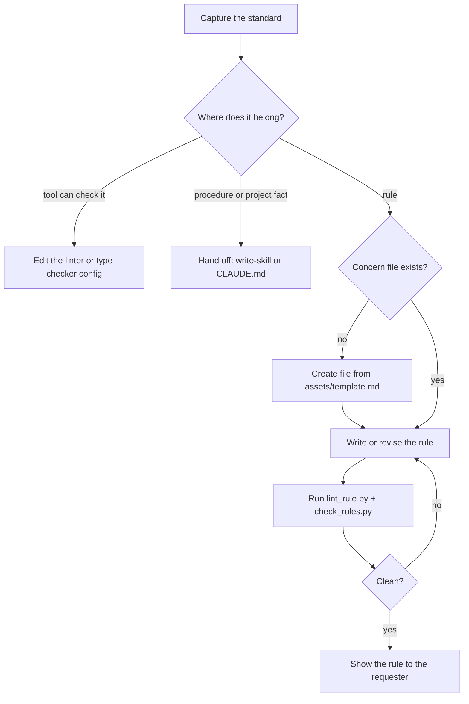

## Goal

A rule file a human can read in 30 seconds, loaded only where it applies.

## In

- The standard to capture (from the requester)
- Existing rule files in `.claude/rules/`
- Scripts named here run as `python3 ${CLAUDE_PLUGIN_ROOT}/scripts/<name>.py`

## Out

- A rule in `.claude/rules/<scope>-<concern>.md`, a tool config change, or a handoff

## Flow

## Rules

- **A tool can check it** → put it in the tool's config, not a rule
  - _Because:_ tools enforce; prose only suggests
- **The standard is for app code (`src/`, `tests/`)** → capture a pattern the code already follows; cite its decision record
  - _Because:_ a rule written before the code guesses at an architecture that may never exist
- **It needs steps** → hand it to write-skill
  - _Because:_ a rule is one situation and one response
- **The situation isn't recognizable mid-task ("write good code")** → rewrite it as the moment it applies
  - _Because:_ a rule with no trigger never fires
- **The standard must apply to brand-new files** → also link the rule from the skill or template that creates them
  - _Because:_ path-scoped rules load on read and edit, not on create (see references/format.md)
- **`paths:` is broader than the concern** → narrow the glob
  - _Because:_ every matching rule loads at once, every session
- **A file would pass 8 rules** → split it by concern
  - _Because:_ one concern per file keeps each file skimmable
- **check_rules.py flags a similar rule in an overlapping file** → merge them into one file
  - _Because:_ two rules on one topic that load together will eventually disagree

## Done When

- [ ] `lint_rule.py` passes
- [ ] `check_rules.py` flags nothing for this file
- [ ] Every situation is recognizable mid-task
- [ ] Requester confirmed the rule says what they meant
- [ ] `.claude/CHANGELOG.md` has its entry (write-changelog-entry)

## Never

- Numbered steps or procedures in a rule
- Rules restating what a linter or type checker already checks
- A rule file without `paths:` unless it states why it's always on

## More

- [assets/template.md](assets/template.md): blank rule file to copy
- [references/format.md](references/format.md): format, limits, loading behavior
- [../../scripts/lint_rule.py](../../scripts/lint_rule.py): format lint; also runs on every write
- [../../scripts/check_rules.py](../../scripts/check_rules.py): flags rules that load together and say the same thing
