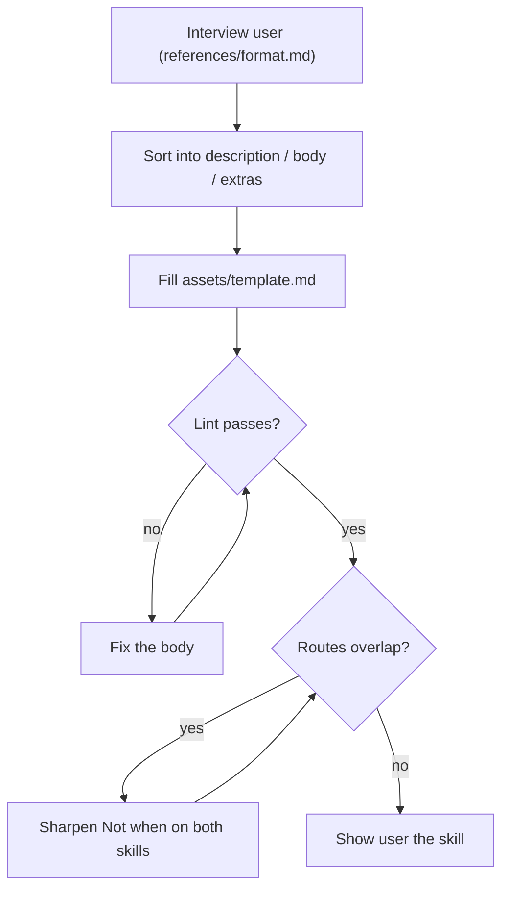

## Goal

A SKILL.md a human can read in 30 seconds, routed by its description alone.

## In

- What the skill should do (from the user)
- Existing SKILL.md, if editing
- Scripts named here run as `python3 ${CLAUDE_PLUGIN_ROOT}/scripts/<name>.py`

## Out

- `.claude/skills/<name>/SKILL.md`
- `references/`, `scripts/`, `assets/`, only if earned

## Flow

## Rules

- **User describes the skill in prose** → turn each sentence into a Flow node, rule, or Done When item; drop the rest
  - *Because:* prose is where skills bloat
- **A rule has no reason** → ask for one, or cut the rule
  - *Because:* reasons let the agent generalize; reasonless rules are usually noise
- **Flow needs more than ~8 nodes** → split into two skills
  - *Because:* one flow = one job
- **Detail runs past ~3 lines (examples, API refs, style)** → move it to `references/`, link it from More
  - *Because:* keeps the body scannable
- **A step is deterministic (parse, format, query)** → put it in `scripts/`; follow references/scripts.md
  - *Because:* code doesn't drift; prose instructions do
- **Description says *how*** → move that into the body
  - *Because:* the description is read only for routing
- **Description names who asks ("user asks…")** → describe the task situation instead
  - *Because:* agents route on descriptions too, often with no user involved
- **Lint fails** → fix the body and rerun
  - *Because:* the limits are the point, not an obstacle

## Done When

- [ ] `lint_skill.py` passes
- [ ] `check_routes.py` shows no overlap for this skill
- [ ] Every rule has a Because
- [ ] User read the skill and confirmed it says what they meant
- [ ] `.claude/CHANGELOG.md` has its entry (write-changelog-entry)

## Never

- Paragraphs in the body
- Instructions in the description
- `references/` created "just in case"

## More

- [assets/template.md](assets/template.md): blank skill to copy
- [references/format.md](references/format.md): section spec and interview questions
- [references/example.md](references/example.md): a complete skill
- [references/scripts.md](references/scripts.md): how skill scripts take input and report
- [../../scripts/lint_skill.py](../../scripts/lint_skill.py): format lint
- [../../scripts/check_routes.py](../../scripts/check_routes.py): routing overlap check
