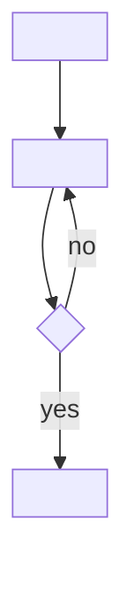

## Goal

<One line: the outcome, not the activity.>

## In

- <input>
- <input (ask if missing)>

## Out

- <artifact produced, and where>

## Flow

## Rules

- **<situation>** → <action>
  - *Because:* <reason>

## Done When

- [ ] <checkable condition>
- [ ] <checkable condition>

## Never

- <hard no>

## More

- [references/<topic>.md](references/<topic>.md): <what it holds>
- [scripts/<name>.sh](scripts/<name>.sh): <what it does>
