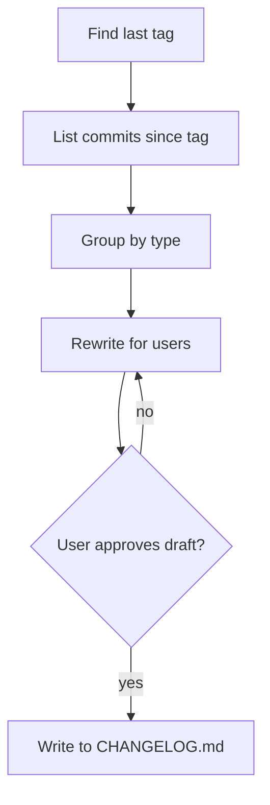

# Example skill

A complete skill in the SKILL.md format, for reference when filling assets/template.md.

````markdown
---
name: release-notes
description: >
  Use when: release notes or a changelog are needed from git history.
  Not when: writing commit messages or PR descriptions.
---

## Goal

Merged commits since the last tag become user-facing release notes.

## In

- Last tag (auto-detect)
- Target version (ask if missing)

## Out

- New section at the top of `CHANGELOG.md`, grouped Added / Fixed / Changed

## Flow



## Rules

- **Commit is chore/ci/test** → drop it
  - _Because:_ users don't care
- **Commit says BREAKING** → list it first, in bold
  - _Because:_ it's what readers must act on
- **Unclear what a commit changes** → read its diff, don't guess
  - _Because:_ wrong notes are worse than none

## Done When

- [ ] Every user-visible change appears exactly once
- [ ] No internal jargon or ticket IDs
- [ ] User approved the draft before it was written

## Never

- Invent changes
- Edit already-released sections

## More

- [references/style.md](references/style.md): tone examples
- [scripts/commits.sh](scripts/commits.sh): commits since tag, as JSON
````
