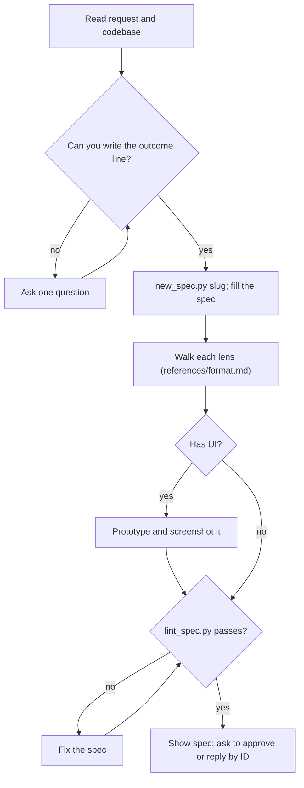

## Goal

A `specs/<id>/spec.md` the requester approves in two minutes, replying by ID.

## In

- The request, in the requester's words (ask if missing)
- The codebase: what exists, what the stack forces

## Out

- `specs/<NNN>-<slug>/spec.md` with `status: draft`, created by `new_spec.py`
- `specs/<id>/prototype.html` and `screens/` when the feature has UI

## Flow

## Rules

- **Creating the spec** → `python3 ${CLAUDE_PLUGIN_ROOT}/scripts/new_spec.py <slug>`; it prints the new path
  - _Because:_ numbers only count up, so a spec's number is its creation order
- **Request leaves a choice open** → pick a default and write it as a D item with its Alt
  - _Because:_ one round trip through the spec beats a questionnaire before it
- **A behavior's outcome can't be observed** → rewrite it until a test could check it
  - _Because:_ each behavior becomes one acceptance test; vague outcomes pass anything
- **A lens adds a risk or state** → add it as a behavior; tag the lens in Because
  - _Because:_ lens notes as prose get skimmed; behaviors get tested
- **Spec passes 12 behaviors or 50 lines** → split into two specs
  - _Because:_ what doesn't fit one screen doesn't get reviewed
- **The feature has UI** → behaviors cover each screen's empty, loading, error, and phone states and its longest real content, or Not doing lists them
  - _Because:_ the states nobody specified are the ones reviewers find missing
- **A screen the design guide has no layout or pattern for** → find 3–5 apps doing it on Mobbin; add a D item choosing its shape
  - _Because:_ a new screen type is then decided once, from evidence, instead of invented in a task
- **Prototyping UI** → static HTML in the spec folder, with the design guide's tokens and worst-case content, then `python3 ${CLAUDE_PLUGIN_ROOT}/scripts/screens.py specs/<id>/screens specs/<id>/prototype.html`
  - _Because:_ a screenshot gets design feedback that a description never does
- **Requester replies by ID** → apply each reply, keep IDs stable, re-lint, show the diff
  - _Because:_ tests and findings point at IDs; renumbering breaks the chain
- **An approved item must change** → retire its ID and add a new one; then re-run tests and tasks for it
  - _Because:_ an ID that changes meaning silently leaves old tests and findings stale
- **Requester approves** → set `status: approved` and commit the spec folder
  - _Because:_ the build skill starts only from an approved spec

## Done When

- [ ] `lint_spec.py specs/<id>/spec.md` passes
- [ ] Every behavior names an observable outcome
- [ ] Requester approved, or explicitly waived approval

## Never

- Implementation detail (file names, libraries) in Behaviors
- Rewording or reusing an ID after approval
- Paragraphs anywhere in the spec

## More

- [references/format.md](references/format.md): sections, item shape, lenses, limits
- [references/example.md](references/example.md): a complete spec, for reference
- [../define-design-system/references/research.md](../define-design-system/references/research.md): searching Mobbin and citing what it finds
- [assets/spec-template.md](assets/spec-template.md): blank spec, copied for each new spec
- [../../scripts/new_spec.py](../../scripts/new_spec.py): creates the next numbered spec folder
- [../../scripts/lint_spec.py](../../scripts/lint_spec.py): format and ID-permanence lint; also runs on every write
- [../../scripts/screens.py](../../scripts/screens.py): phone and desktop screenshots in each theme
